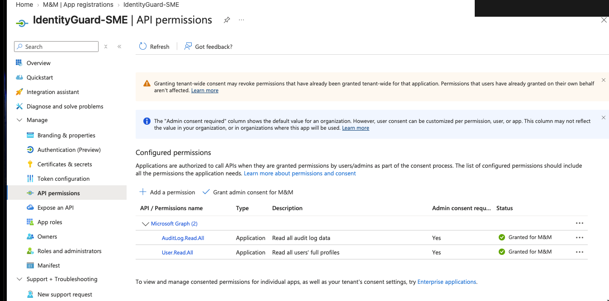
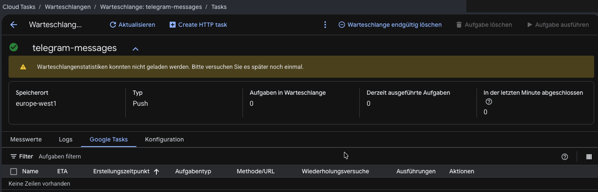
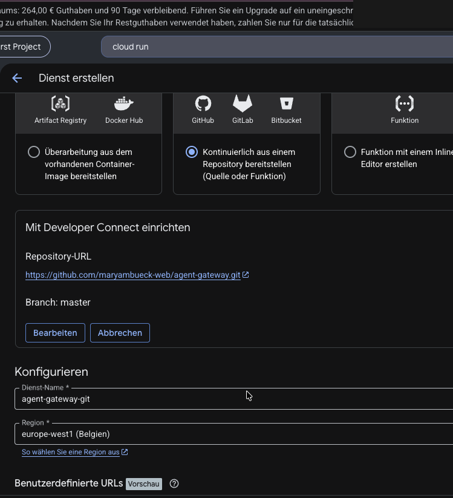
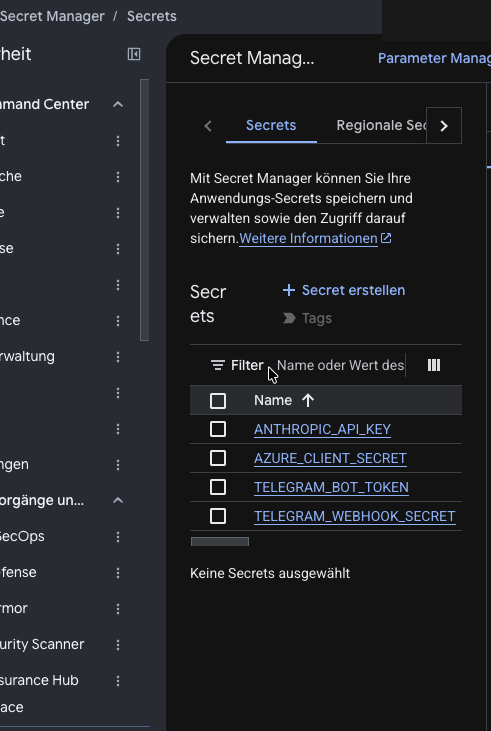
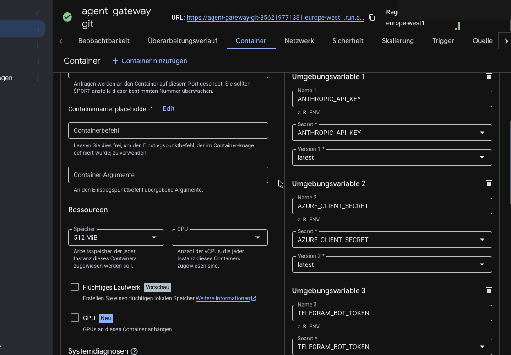

# IdentityGuard SME — Project Progress

This page documents selected implementation steps from the IdentityGuard SME proof of concept.

> Security note: only sanitized screenshots are included. No `.env` values, API keys, client secrets, Telegram tokens, webhook secrets, personal sign-in records, or IP addresses are stored here.

## Architecture

```text
Telegram
  → Cloud Run webhook
  → Cloud Tasks
  → Microsoft Graph / Entra sign-ins
  → normalization
  → deterministic rules
  → structured findings
  → Claude explanation
  → explanation validator
  → Telegram response
```

## 1. Microsoft Graph permissions



Configured the Entra application with Microsoft Graph application permissions `AuditLog.Read.All` and `User.Read.All`, with admin consent. These permissions allow IdentityGuard SME to read the sign-in and user information needed by the deterministic security rules.

## 2. Cloud Tasks queue



Created the `telegram-messages` Cloud Tasks queue in `europe-west1`. This separates the public Telegram webhook from the longer-running security analysis worker.

## 3. GitHub to Cloud Run deployment



Connected the GitHub repository and `master` branch to Cloud Run for continuous deployment. Pushed commits can be built and deployed as new Cloud Run revisions.

## 4. Secret Manager



Stored production credentials in Google Secret Manager instead of committing them to source control. Only secret names are shown here; no secret values are included.

## 5. Cloud Run secret references



Configured Cloud Run to read sensitive configuration through Secret Manager references instead of storing credentials directly in normal environment variables.

## Current result

The project now supports the production flow from Telegram through Cloud Run and Cloud Tasks into Microsoft Graph sign-in analysis, deterministic rules, Claude explanation, validation, and a Telegram security response.
